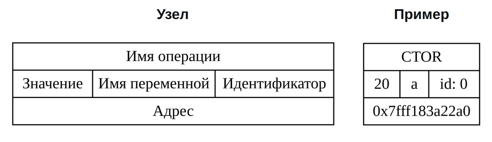
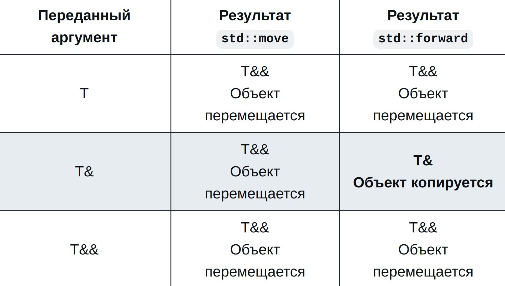

**STD::MOVE vs STD::FORWARDING**
================================

**Предисловие**
---------------

Думаю, многим известно, что в определённых случаях копирование лучше перемещения, но не всегда можно добиться перемещения везде, где хочется. Именно поэтому я решила написать статью с примерами и картинками о таких инструментах программирования, как std::move и std::forward.

**Инструменты**
---------------

Для того чтобы перехватывать события, происходящие в примерах, я написала класс `Intercepted_int`, имитирующий поведение типа int. Чтобы <<перехватить>> создание переменной, я использовала макрос `Var(var_name, var_value)`, который на самом деле означает `int var_name = var_value`.

Сами события я визуализировала при помощи инструмента Graphviz, поэтому приведу пояснение тому, что означают структуры на картинках:
<li>
Красный цвет обозначает операторы копирования, зелёный - операторы перемещения;
</li>
<li>
Чёрные пунктирные стрелки ведут от конструкторов к деструкторам, таким образом обозначая их время жизни;
</li>
<li>
Чёрные слитные стрелки показывают связь между переменными и оператором, их связывающим. Например, если складываются переменные, то вы увидите такие стрелки, ведущие от них к структуре оператора сложения;
</li>
<li>
Красные слитные стрелки проведены между операторами, меняющими значение одной конкретной переменной. Эти стрелки удалены между структурами конструктора и деструктора, чтобы не захламлять картинку;
</li>
<li>
Серый прямоугольный фон означает, что события происходят внутри скоупа функции, имя которой написано в самом верху этого прямоугольника;
</li>
<li>
Организация информации в прямоугольных структурах с примером указана ниже:
</li>

<li>
Организация информации в структурах формы шестиугольника с примером указана в таблице ниже:
</li>

**Мотивация**
-------------

Итак, представьте себе ситуацию, в которой вы хотите оптимизировать свой код, избежав лишнего копирования данных, но оно происходит, просто потому что компилятор не знает о ваших намерениях. В качестве примера я приведу код, в котором присваивание в локальную переменную имитирует присваивание в какой-нибудь контейнер:

<pre><code>
template&ltclass T&gt
void container_push_imitaion(T&& arg) 
{
    volatile auto local_tmp = arg; // как будто пишем в контейнер
}

template&ltclass T&gt
void wrapper(T&& arg) 
{
    container_push_imitaion(arg);
}

void test()
{
    wrapper(Intercepted_int(22));
}
</pre></code>

В функции container_push_imitation аргумент, переданный в качестве rvalue, стал lvalue, из-за чего он и был скопирован. Чтобы любезно нам помочь, на сцене появляется std::move:

<pre><code>
template&ltclass T&gt
void container_push_imitaion(T&& arg) 
{
    volatile auto local_tmp = std::move(arg); // как будто пишем в контейнер
}

template&ltclass T&gt
void wrapper(T&& arg) 
{
    container_push_imitaion(arg);
}

void test()
{
    wrapper(Intercepted_int(22));
}
</pre></code>

Давайте посмотрим на результат:

Как вы уже могли заметить, std::move превращает любой переданный аргумент в rvalue-ссылку. Действительно, ведь сначала он убирает все возможные ссылки, а потом использует static_cast. Очень полезная вещь, ведь по сути он даёт компилятору знать, что в этом месте можно применить операторы перемещения, и в итоге позволяет, например, класть в контейнеры элементы, у которых запрещены какие-либо операторы копирования.

**Появляется проблема**
-----------------------

Рассмотрим следующий код:

<pre><code>
template&ltclass T&gt
void container_push_imitaion(T arg) 
{
    volatile auto local_tmp = arg; // как будто пишем в контейнер
}

template&ltclass T&gt
void wrapper(T&& arg) 
{
    container_push_imitaion(std::move(arg));
}

void test()
{
    VAR(a, 20);
    
    printf("variable a: %d\n", a.get_num());
    
    container_push_imitaion(a);
    
    printf("variable a after \"safe\" function: %d\n", a.get_num());

    wrapper(a);

    printf("variable a after wrapper: %d\n", a.get_num());
}
</pre></code>

Теперь посмотрим на вывод:

<pre><code>
variable a: 20
variable a after "safe" function: 20
variable a after wrapper: 0
</pre></code>

Кажется, намеренно мы переменную `a` не меняли. Виной этому именно std::move, а точнее, программист, который неправильно его использовал. Тогда появляется новое действующее лицо - std::forward, и вот как поменяется наш код:

<pre><code>
template&ltclass T&gt
void container_push_imitaion(T arg) 
{
    volatile auto local_tmp = std::forward&ltT&gt(arg); // как будто пишем в контейнер
}

template&ltclass T&gt
void wrapper(T&& arg) 
{
    container_push_imitaion(std::forward&ltT&gt(arg));
}

void test()
{
    VAR(a, 20);
    
    printf("variable a: %d\n", a.get_num());
    
    container_push_imitaion(a);
    
    printf("variable a after \"safe\" function: %d\n", a.get_num());

    wrapper(a);

    printf("variable a after wrapper: %d\n", a.get_num());
}
</pre></code>

А вот как поменяется вывод:

<pre><code>
variable a: 20
variable a after "safe" function: 20
variable a after wrapper: 20
</pre></code>

Теперь мы получили, что хотели.

**Возможное недоумение**
------------------------

Внимательный и незнакомый с принципом работы инструмента std::forward читатель скажет: "Но если в этом случае не вызывать std::forward, будет абсолютно то же самое!". И это правда:

Всё дело в передаваемом аргументе. Теперь <<загрузим>> в ту же функцию `rvalue`:

Стоит отметить, что здесь важно <<форвардить>> аргумент при имитации загрузки в контейнер, иначе ничего не сработает.

И таким образом, приходим к осознанию, что `std::forward` хорош при точной, <<прозрачной передаче>> переменной, так как он оставляет `lvalue`-ссылку `lvaue`-ссылкой, а всё остальное приводит к `rvalue`.

Посмотрим, чем отличаются std::move и std::forward:

Почему бы не использовать только `std::forward`?

И правда, на первый взгляд может показаться, что `std::forward` работает иногда даже лучше и в некотором смысле безопаснее, чем `std::move`. Ответ на этот вопрос заключается в идее использования этих инструментов. `std::forward` требует явное указание шаблонного типа, что иногда захламляет код. К тому же явное назначение этой функции - идеальная передача, сохранение изначального типа объекта при <<перебрасывании>> его через функции. Этих двух причин достаточно, чтобы использовать `std::forward` только по назначению, а при работе с взаимодействием объектов в случае надобности использовать `std::move`.

**Заключение**
--------------

Подведём итоги и вспомним, что было выше. Иногда программисту необходимо сообщить компилятору, что переменную можно перемещать или просто избежать ошибки компиляции из-за несуществования конструкторов копирования, и для этого подходит `std::move`. Работая с большим кодом, часть которого даже не под его ответственностью, программисту следует быть аккуратным, передавая полученные аргументы в другие функции - он использует `std::forward`.

Очень важным будет, на мой счёт, продублировать табличку выше. Она очень простая и тем не менее очень наглядно показывает разницу между `std::move` и `std::forward`:

Таким образом, очень важно правильно использовать вышеупомянутые инструменты, чётко понимая, чего вы от них хотите.
